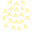

<!---
This file is generated from the "details.yml" file. (Any changes here will be overwritten)
--->
#  BoidSim
> ###  **[echo-lalia](https://github.com/echo-lalia)**  
> Version: **1.0** | License: **[MIT](https://github.com/echo-lalia/MicroHydra-Apps/blob/main/LICENSE)**  
> App name: **Boids**
 

This app randomly arranges a bunch of [boids](https://en.wikipedia.org/wiki/Boids) (and obsticals), and simulates them.  
You can also hit enter to get a new random setup.

This app randomly selects one of a few different pre-determined sets of input parameters.  
Then, randomly places boids and (randomly sized) obsticals around the screen.

  

-----
### Installation:
Copy the app into your `/apps` folder.

